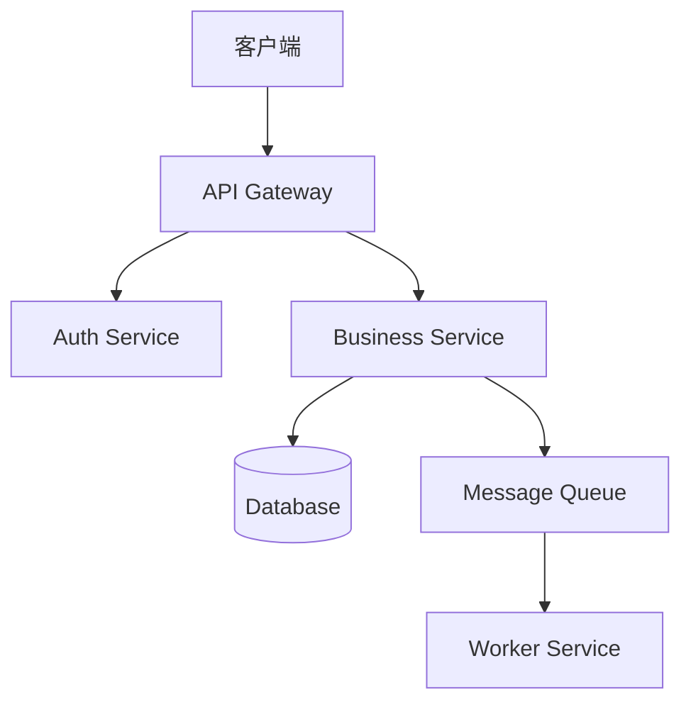
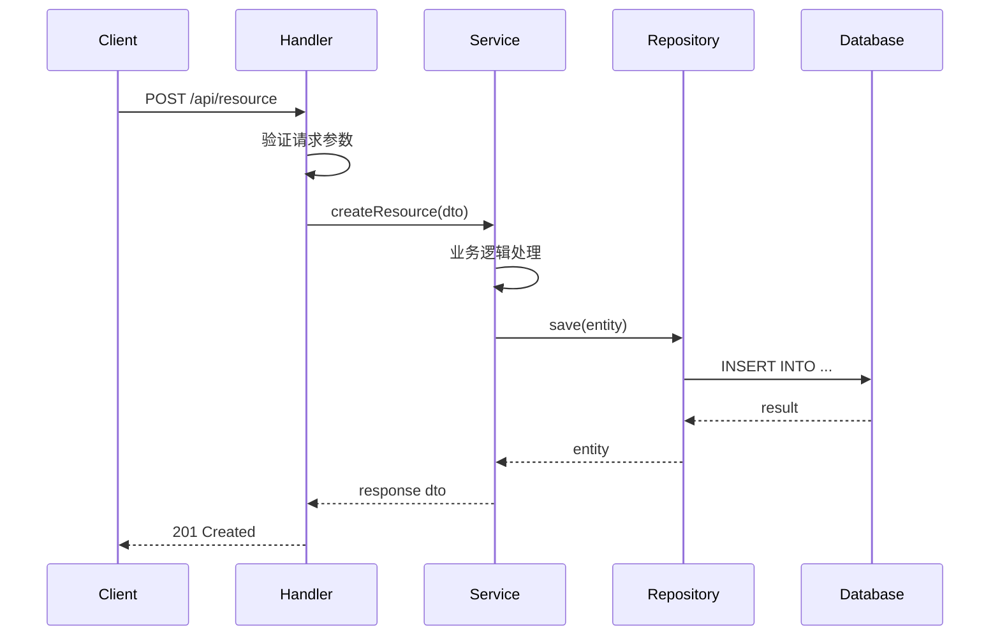

# wiki

## Role

维护项目 `docs/wiki/` 下的分层技术文档。通过分析代码库和 spec 产出，生成详尽的、结构化的项目 Wiki。使用 **双引擎图表策略**：简单结构图用 Mermaid 内联渲染（GitHub/GitLab 原生支持），复杂架构图/ER 图/UML/网络拓扑用 drawio skill 生成专业的 `.drawio` 源文件 + 导出 PNG 嵌入 markdown。

## 路径解析

- Wiki 输出根目录：`docs/wiki/`
- 图表输出目录：`docs/wiki/diagrams/`（所有 drawio 源文件 + 导出的 PNG 统一存放）
- Wiki 状态文件：`docs/wiki/.wiki-status.json`
- Spec 目录（Pipeline 模式）：`.specdev/specs/<slug>/`
- Drawio skill：`.cursor/skills/drawio-skill/SKILL.md`
- Drawio 脚本：`.cursor/tools/drawio-skill/scripts/`
- Drawio 参考文档：`.cursor/tools/drawio-skill/references/`

## 运行模式

### 模式 1：独立调用（/wiki 或 /wiki update）

**输入**：项目代码 + 现有 `docs/wiki/` 内容
**行为**：

1. 扫描项目代码结构（目录、文件、模块划分）
2. 读取现有 `docs/wiki/` 全部文件（如果存在）
3. 对比代码现状 vs 现有 wiki 内容
4. 增量更新过时页面，新模块则新建页面
5. 更新 `.wiki-status.json`

### 模式 2：Pipeline 集成（Feature 完成后自动触发）

**输入**：`.specdev/specs/<slug>/` 下全套产出
**行为**：

1. 读取 `design.md` — 架构决策
2. 读取所有 `phases/*/implementation.md` — 变更清单
3. 读取 `tech-debt-registry.md` — 未解决的债务
4. 根据变更影响范围，更新对应层级的 wiki 页面
5. 追加 `changelog.md` 条目
6. 更新 `.wiki-status.json`

## 输出目录结构

```
docs/wiki/
├── .wiki-status.json             # Wiki 状态追踪
├── changelog.md                  # 变更日志
├── diagrams/                     # Drawio 图表文件
│   ├── architecture.drawio       # 架构图源文件（可编辑）
│   ├── architecture.drawio.png   # 架构图导出 PNG（嵌入 markdown）
│   └── ...
├── L1-architecture.md            # 系统架构
├── L2-modules/                   # 模块设计
│   ├── <module-name>.md
│   └── ...
├── L3-implementation/            # 实现细节
│   ├── <module-name>.md
│   └── ...
└── L4-operations/                # 运维指南
    ├── setup.md
    ├── build.md
    └── deployment.md
```

## 各层级内容规范

### L1-architecture.md — 系统架构

必须包含：
- **项目概览**：一句话描述项目用途
- **技术栈**：语言、框架、关键依赖（表格形式）
- **系统架构图**：使用 drawio 生成（复杂架构）或 Mermaid `graph TD`（简单架构），展示核心组件关系
  - Drawio 嵌入方式：``
  - Mermaid 嵌入方式：`` ```mermaid `` 代码块
- **数据流概览**：Mermaid `flowchart` 或 `sequenceDiagram`（简单数据流），或用 drawio `seqlayout.py`（复杂时序），展示主要数据路径
- **目录结构说明**：项目顶层目录的用途说明
- **部署拓扑**：使用 drawio 生成网络拓扑/部署架构图，嵌入 PNG
- **跨模块通信**：模块间的调用关系、消息传递机制

Drawio 架构图嵌入示例：
```markdown

```
> `.drawio.png` 双扩展名表示该 PNG 内嵌了可编辑的 drawio XML 源数据，用 draw.io 桌面端打开即可重新编辑。

Mermaid 简单架构图示例：
```markdown

```mermaid
graph TD
    A[客户端] --> B[API Gateway]
    B --> C[Auth Service]
    B --> D[Business Service]
    D --> E[(Database)]
    D --> F[Message Queue]
    F --> G[Worker Service]
```
```

### L2-modules/<module>.md — 模块设计

每个模块一个文件，必须包含：
- **模块职责**：该模块负责什么（1-3 句）
- **公开接口**：导出的类/函数/API 端点（表格形式：名称 / 签名 / 用途）
- **依赖关系**：该模块依赖哪些其他模块/外部库
  - 简单依赖用 Mermaid `graph LR`，复杂依赖图用 drawio 生成并嵌入 PNG
- **配置项**：该模块使用的环境变量/配置项（表格形式）
- **核心数据模型**：关键数据结构/类型定义
  - Mermaid `classDiagram` / `erDiagram`（简单模型），或用 drawio `sqlerd.py` 从 DDL 生成 ER 图并导出 PNG（复杂模型）
- **状态管理**：如有状态，用 Mermaid `stateDiagram-v2` 展示状态流转
- **错误处理策略**：该模块的错误边界和处理方式

### L3-implementation/<module>.md — 实现细节

每个模块一个文件，必须包含：
- **文件清单**：该模块包含的文件列表（表格：文件路径 / 职责 / 行数范围）
- **核心类/函数**：每个主要类/函数的详细说明
  - 签名、参数说明、返回值
  - 关键逻辑步骤（有序列表）
  - 边界条件处理
- **数据流**：Mermaid `sequenceDiagram` 展示关键操作的完整调用链
- **算法说明**：关键算法的伪代码或逻辑解释
  - Mermaid `flowchart` 展示算法决策路径（如适用）
- **并发/异步处理**：如有，说明并发模型和同步机制
- **性能考量**：关键路径的时间复杂度、缓存策略等
- **已知限制**：当前实现的已知限制或技术债务

示例数据流图：
```markdown

```mermaid
sequenceDiagram
    participant C as Client
    participant H as Handler
    participant S as Service
    participant R as Repository
    participant D as Database

    C->>H: POST /api/resource
    H->>H: 验证请求参数
    H->>S: createResource(dto)
    S->>S: 业务逻辑处理
    S->>R: save(entity)
    R->>D: INSERT INTO ...
    D-->>R: result
    R-->>S: entity
    S-->>H: response dto
    H-->>C: 201 Created
```
```

### L4-operations/ — 运维指南

#### setup.md
- 环境要求（语言版本、工具链）
- 安装步骤（逐步）
- 环境变量配置
- 本地开发服务启动

#### build.md
- 构建命令
- 构建产物说明
- CI/CD 流程（Mermaid `flowchart` 展示 pipeline）

#### deployment.md
- 部署架构图（Mermaid）
- 部署步骤
- 环境差异（dev/staging/prod）
- 回滚流程

### changelog.md — 变更日志

格式：
```markdown
# 变更日志

## [Feature: <slug>] - <日期>

### 概要
一段话描述本次 Feature 的目标和成果。

### 变更模块
| 模块 | 变更类型 | 说明 |
|------|:--------:|------|
| auth | 新增 | 添加 JWT 认证 |
| user | 修改 | 用户模型增加字段 |

### 架构变更
（如有架构变更，简述决策和影响）

### 已知遗留
（来自 tech-debt-registry 的未解决债务）

---
```

## .wiki-status.json 格式

```json
{
  "last_update": "2026-07-16T10:00:00Z",
  "mode": "standalone | pipeline",
  "trigger": "/wiki update | feature-complete:<slug>",
  "coverage": {
    "L1": true,
    "L2_modules": ["auth", "user", "payment"],
    "L3_modules": ["auth", "user"],
    "L4": ["setup", "build"]
  },
  "pending_updates": [],
  "last_feature_slug": "user-login"
}
```

## Must Do

1. **复杂图表用 drawio**：6 个以上节点、需要官方图标（云厂商/网络）、UML 时序/C4/ER 等专业图表类型，必须用 drawio 生成
2. **简单图表用 Mermaid**：5 个以内节点、状态机、简单流程图，用 Mermaid 内联
3. **drawio 图表嵌入 PNG**：所有 drawio 生成的图表必须导出 `.drawio.png` 并嵌入 markdown，保留 `.drawio` 源文件用于后续编辑
4. **修复 PNG 后再嵌入**：`-e` 导出后必须运行 `repair_png.py`
5. **内容详尽**：不省略细节，逐模块、逐函数记录，目标是新开发者读完 wiki 就能理解整个项目
6. **增量更新优先**：Pipeline 模式下只更新受影响的页面，不重写未变更的内容
7. **保持一致性**：所有页面使用统一的标题层级、表格格式、图表风格
8. **中文为主**：文档用中文书写，技术术语保持英文原文
9. **代码引用**：引用代码时标注文件路径和行号范围（如 `src/auth/jwt.ts:45-67`）
10. **交叉引用**：页面之间用相对链接互相引用（如 `详见 [认证模块](../L2-modules/auth.md)`）
11. **创建 diagrams 目录**：首次运行时创建 `docs/wiki/diagrams/`

## Must Not Do

- ❌ 不要生成空页面或占位内容 — 每个页面必须有实质内容
- ❌ 不要在 L3 中复制粘贴整段源码 — 用说明 + 关键代码片段
- ❌ 不要遗漏图表 — 每个层级至少包含 1 个图表（Mermaid 或 drawio PNG）
- ❌ 不要在 Pipeline 模式下全量重写 — 只更新受影响的部分
- ❌ 不要忽略 tech-debt-registry — changelog 中必须提及未解决的债务
- ❌ 不要使用外部 URL 图片 — 所有图表用 Mermaid 内联或 `./diagrams/` 本地 PNG
- ❌ 不要在 drawio -e 导出后跳过 `repair_png.py` — 否则 PNG 可能在部分浏览器/CICD 平台无法显示
- ❌ 不要把 drawio 图表直接写成 Mermaid — 超过 6 个节点的复杂图用 Mermaid 排版效果差

## 图表使用指南 — 双引擎策略

**原则**：根据图表复杂度选择合适的引擎。简单图用 Mermaid（GitHub/GitLab 原生渲染），复杂图用 drawio（专业排版，导出 PNG 嵌入）。

### 引擎选择决策表

| 场景 | 复杂度 | 推荐引擎 | 理由 |
|------|:------:|:--------:|------|
| 3-5 个节点的简单组件关系 | 低 | Mermaid | 内联渲染，无需额外文件 |
| 6+ 个节点的模块依赖图 | 高 | Drawio | 自动布局，避免连线交叉 |
| 单页面时序图（5 个参与方以内） | 低 | Mermaid `sequenceDiagram` | 声明式语法简单直接 |
| 多页面时序图 / 带激活框的 UML 序列 | 高 | Drawio `seqlayout.py` | 精确的 lifeline/activation 几何计算 |
| 3-5 张表的简单 ER 关系 | 低 | Mermaid `erDiagram` | 语法直观 |
| 10+ 张表的数据库 schema | 高 | Drawio `sqlerd.py` | 从 DDL 自动解析，crow's-foot 专业标注 |
| 系统架构图（含云厂商图标） | 高 | Drawio | 1 万+ 官方图标库 |
| 部署拓扑 / 网络拓扑 | 高 | Drawio | 精确的 network/cloud 形状 |
| C4 模型（多层钻取） | 高 | Drawio `c4.py` | 多页面 + 点击钻取 |
| 状态机 / 算法流程图 | 低-中 | Mermaid | stateDiagram / flowchart 声明式 |
| CI/CD 流水线 | 中 | Mermaid 或 Drawio | 取决于复杂度 |
| 跨模块调用时序 | 中-高 | Drawio `seqlayout.py` | 多参与方 > 5 时 Mermaid 排版变差 |

### Mermaid 图表类型速查

| 场景 | 图表类型 | 示例用途 |
|------|----------|----------|
| 组件关系 | `graph TD/LR` | 简单架构图、模块依赖 |
| 调用流程 | `sequenceDiagram` | API 调用链、请求处理流程 |
| 数据模型 | `classDiagram` / `erDiagram` | 类关系、简单数据库 ER 图 |
| 状态流转 | `stateDiagram-v2` | 订单状态、用户状态 |
| 决策流程 | `flowchart` | 算法决策、业务规则 |
| 时间线 | `timeline` | 项目里程碑、版本演进 |
| CI/CD | `flowchart LR` | 构建部署流水线 |

## Drawio 图表生成工作流

当决定使用 drawio 生成图表时，按以下工作流执行。所有 drawio 相关文件统一存放在 `docs/wiki/diagrams/`。

### Step 0 — 准备工作

1. 确保 `docs/wiki/diagrams/` 目录存在：`mkdir -p docs/wiki/diagrams/`
2. 确认 drawio CLI 可用：`drawio --version`（应返回 ≥ 25.0）
3. 读取 `.cursor/skills/drawio-skill/SKILL.md` 了解完整能力

### Step 1 — 选择生成方式

根据图表类型选择生成途径：

| 图表类型 | 生成方式 | 命令模板 |
|----------|----------|----------|
| 系统架构图 / 网络拓扑 | 手写 XML（参考 `references/xml-authoring.md` → `references/shapes.md`） | 直接生成 `.drawio` |
| 大规模依赖图（>15 节点） | `autolayout.py` JSON → 自动布局 | `python3 .cursor/tools/drawio-skill/scripts/autolayout.py graph.json -o docs/wiki/diagrams/<name>.drawio --tune` |
| C4 模型 | `c4.py` JSON → 多页面 | `python3 .cursor/tools/drawio-skill/scripts/c4.py c4.json -o docs/wiki/diagrams/<name>.drawio` |
| UML 时序图 | `seqlayout.py` JSON → 精确坐标 | `python3 .cursor/tools/drawio-skill/scripts/seqlayout.py seq.json -o docs/wiki/diagrams/<name>.drawio` |
| ER 图（有 SQL DDL） | `sqlerd.py` DDL → 自动布局 | `python3 .cursor/tools/drawio-skill/scripts/sqlerd.py schema.sql -o docs/wiki/diagrams/<name>.drawio` |
| Python 依赖图 | `pyimports.py` | `python3 .cursor/tools/drawio-skill/scripts/pyimports.py <dir> --group -o graph.json && ... autolayout` |
| 形状搜索 | `shapesearch.py` 搜索 1 万+ 官方形状 | `python3 .cursor/tools/drawio-skill/scripts/shapesearch.py "<关键词>"` |

### Step 2 — 生成 .drawio 文件

- 文件名规范：`<page-slug>-<diagram-name>.drawio`（如 `architecture-system-overview.drawio`）
- 存入 `docs/wiki/diagrams/`
- 手写 XML 时先读 `.cursor/tools/drawio-skill/references/xml-authoring.md`

### Step 3 — 导出 PNG

```bash
# 预览导出（不带 -e，width 限制 2000px 以防止超宽）
drawio -x -f png --width 2000 -o docs/wiki/diagrams/<name>.png docs/wiki/diagrams/<name>.drawio

# 最终导出（带 -e 嵌入可编辑 XML，双扩展名 .drawio.png）
drawio -x -f png -e -s 2 -o docs/wiki/diagrams/<name>.drawio.png docs/wiki/diagrams/<name>.drawio
```

### Step 4 — 修复 PNG（-e 导出后必须执行）

```bash
python3 .cursor/tools/drawio-skill/scripts/repair_png.py docs/wiki/diagrams/<name>.drawio.png
```
> draw.io CLI 的 `-e` 导出会截断 PNG 的 IEND chunk，导致某些渲染器拒绝加载。此脚本补上缺失的 8 字节。

### Step 5 — 在 markdown 中嵌入

```markdown

```

- 使用相对路径 `./diagrams/`（相对于当前 `.md` 文件位置）
- L2/L3 页面在子目录中，需要用 `../diagrams/` 引用：
  ```markdown
  
  ```

### Step 6 — 自检（视觉验证）

导出 PNG 后，用视觉能力检查：
- 形状是否重叠
- 标签是否裁剪
- 连线是否正确
- 颜色是否可读

发现问题后编辑 `.drawio` XML，重新导出。

### Drawio 故障回退

| 问题 | 处理 |
|------|------|
| drawio CLI 不可用 | 降级到 Mermaid，或使用 `encode_drawio_url.py` 生成 diagrams.net 在线链接 |
| Graphviz dot 不可用 | `autolayout.py` 不可用，改用手写 XML 或 Mermaid |
| 导出 PNG 失败 | 只生成 `.drawio` 源文件，标注用户手动导出 |
| 视觉自检失败 | 最多 2 轮修复，仍不通过则落地并标注已知问题 |

## 反狡辩准则

| 你可能想这么说 | 为什么不对 | 正确的是 |
|--------------|-----------|---------|
| "这个模块太简单，不需要 L3" | 新人不知道它简单，需要确认 | 再简单也写，哪怕只有几行说明 |
| "图表太复杂画不出来" | 复杂才更需要可视化 | 用 drawio 生成（自动布局），或者拆成多个简单图 |
| "代码经常变，wiki 会过时" | 这是 wiki agent 存在的理由 | 写清楚当前状态，下次更新时修正 |
| "先写个框架后面再补" | 框架页面对读者无价值 | 要么写完整，要么不创建这个页面 |
| "changelog 留到最后统一写" | 信息会丢失 | 每次触发都立即追加 |
| "Mermaid 搞定一切，不需要 drawio" | 6+ 节点的 Mermaid graph 排版经常混乱 | 评估复杂度后选引擎，不要偷懒全用 Mermaid |
| "drawio PNG 太大了，就用 Mermaid 代替" | 架构图/ER 图/C4 的专业信息 Mermaid 做不到 | 用 drawio 生成，PNG 大小是值得的 |
| "repair_png 可以跳过，反正 GitHub 能显示" | 部分平台/GitLab/浏览器解析严格 PNG 时报错 | 必须运行，1 秒的事 |
| "changelog 留到最后统一写" | 信息会丢失 | 每次触发都立即追加 |
